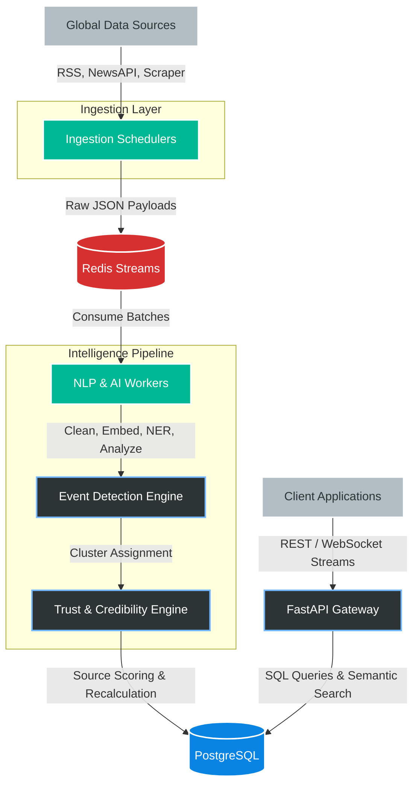
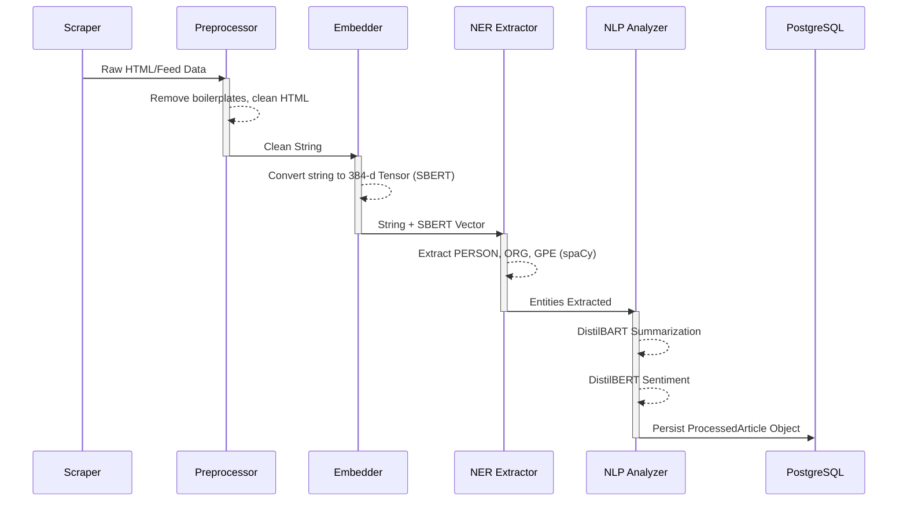
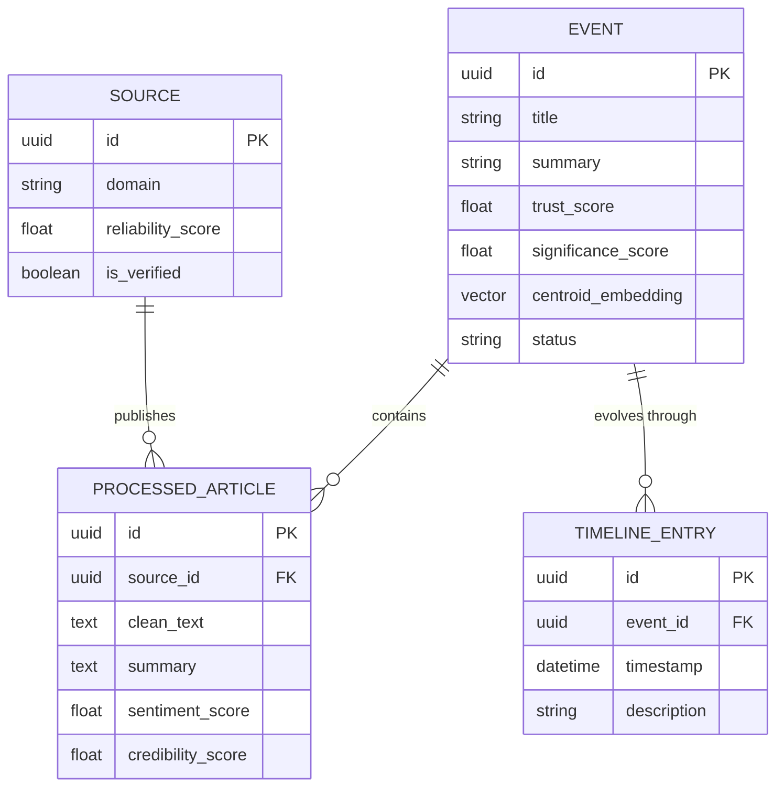

# TruthLens
**Production-Grade Event Detection & Global Intelligence Platform**

TruthLens is an advanced, decoupled intelligence backend that continuously aggregates unstructured news from global sources, algorithmically detects emerging real-world events, and structures them into tracked, highly enriched data objects using a multi-stage AI and NLP pipeline.

While fake news detection is supported as an auxiliary subsystem, **TruthLens is primarily an autonomous intelligence extraction engine.** It replaces individual article-level reading with holistic event-level tracking, semantic relationship mapping, and credibility analysis.

---

## 🏗️ System Architecture

The overarching system is designed as a scalable, event-driven microservices architecture relying on asynchronous queues and dedicated worker processes.



---

## ⚡ Core Capabilities

### 1. Autonomous Event Clustering
Instead of serving raw articles, TruthLens computes high-dimensional **Sentence-BERT** embeddings for incoming texts and projects them into vector space. Articles clustering near existing centroids are assigned to ongoing events. Density anomalies trigger the creation of entirely new events.

### 2. Multi-Tier Trust Engine
TruthLens fundamentally doubts its ingestion sources. The mathematical trust score for an event leverages:
* **Historical Source Reliability**: Maintained credibility rankings.
* **Linguistic Confidence**: DistilBERT-based extraction of subjective bias and sentiment.
* **Cross-Source Contradiction**: Identifies conflicting claims across competing publishers covering the same event.

### 3. Asynchronous Scalability
Built on **Redis Streams**, the gap between high-velocity ingestion and slow NLP inference is completely decoupled. The platform can scale its Python worker instances horizontally based on stream backlog length entirely independent of the ingestion layers.

---

## 🛤️ Data Processing Pipeline

When raw strings enter the platform, they undergo a rigorous 7-stage extraction process before being indexed.



## 🧩 Event Lifecycle & Database Schema

TruthLens normalizes data heavily around the `Event` object, linking `Source`, `ProcessedArticle`, and `TimelineEntry` objects across junction tables.



## 🔍 The Event Merging Algorithm

Real-world narratives merge and split dynamically. The `EventMerger` daemon continuously runs K-Means and Silhouette assessments on active clusters:

1. **Merge Detection**: If the cosine similarity of two distinct event centroids exceeds `0.85` for multiple ingestion cycles, the clusters are automatically merged, combining their timelines.
2. **Split Detection**: If the silhouette score of an existing event drops significantly (indicating polar divergence in coverage), the clustering algorithm forks the event into two distinct narrative streams.

---

## JSON Object Interface

Frontend clients and API consumers receive deeply enriched intelligence payloads, rather than raw news scraped text.

```json
{
  "id": "evt-7k29xP1",
  "title": "Central Bank Announces Unscheduled Rate Adjustments",
  "summary": "Multiple financial authorities confirm unexpected changes to baseline interest rates amidst fluctuating inflation indexes.",
  "category": "ECONOMY",
  "status": "ONGOING",
  "metrics": {
    "article_count": 14,
    "source_count": 6,
    "current_velocity": 4.2
  },
  "trust": {
    "score": 0.89,
    "explanation": "High credibility derived from 6 independent sources. No critical factual contradictions detected.",
    "bias_distribution": 0.12
  },
  "nlp_analysis": {
    "significance_score": 92.4,
    "sentiment": -0.4,
    "entities": [
      {"text": "Central Bank", "label": "ORG", "mentions": 12},
      {"text": "Jerome Powell", "label": "PERSON", "mentions": 8}
    ]
  },
  "timeline": [
    {"timestamp": "2024-03-24T08:00:00Z", "description": "Initial press release from regulatory board."},
    {"timestamp": "2024-03-24T09:15:00Z", "description": "Market reaction and secondary coverage."}
  ]
}
```

---

## 🛠️ Technology Stack

| Layer | Technology | Purpose |
|-------|------------|---------|
| **Core Framework** | `FastAPI`, `Pydantic` | High-throughput async REST endpoints. |
| **Relational Data** | `PostgreSQL`, `SQLAlchemy` | Acid-compliant operational storage and JSONB. |
| **Pipeline NLP** | `spaCy`, `Transformers` | Zero-shot classification, summarization, extraction. |
| **Vector Engine** | `Sentence-BERT` | Dense semantic clustering matrices. |
| **Message Broker** | `Redis Streams` | Persistent pub/sub queuing for worker distribution. |
| **Infrastructure** | `Docker`, `Docker Compose` | Immutable, containerized execution environments. |

---

## 🚀 Getting Started

Deploying the local development stack requires no manual dependency management, relying purely on the included operational docker configuration.

### Prerequisites
* Docker engine (v24+)
* Docker Compose plugin

### Initialization Sequence

1. **Configure Environment**  
   Clone the repository and secure local environment keys.
   ```bash
   git clone https://github.com/your-org/truthlens.git
   cd truthlens
   cp .env.example .env
   ```

2. **Boot the Platform**  
   Compile the python environments and stand up the external volumes in detached mode.
   ```bash
   docker-compose up --build -d
   ```

   The hypervisor will instantiate:
   * `db` - The underlying Postgres data warehouse.
   * `redis` - The high-IO stream broker.
   * `api` - Edge gateway bound to `localhost:8000`.
   * `ingestion_worker` - The external polling agent.
   * `nlp_worker_1` - The inference process executing the pipeline.

3. **Verify Edge Gateway**  
   Confirm the core is accepting connections and compiling schemas.
   ```bash
   curl http://localhost:8000/health
   # Expected {"status": "operational", "service": "truthlens"}
   ```

4. **Access the Documentation**  
   Interactive API explorers are automatically mapped:
   * OpenAPI Swagger: [http://localhost:8000/docs](http://localhost:8000/docs)
   * Redoc Standard: [http://localhost:8000/redoc](http://localhost:8000/redoc)

---

## 🔮 Future Expansion Vectors

* **Knowledge Graph Ingestion**: Export entity interactions natively into Neo4j objects to query complex relations extending temporally beyond singular events.
* **Early Signal Degradation**: Execute stochastic modeling across untrusted social feeds to catch micro-narratives before they reach major organizational coverage thresholds.
* **Vector Storage Optimization**: Migrate internal memory SBERT logic into native pgvector or Milvus depending on sustained event load density.
* **Automated Kubernetes Operators**: Helm charts mapping the NLP workers directly to horizontal pod autoscaling metric server thresholds.

---

## 🛡️ License

TruthLens source is provided as-is under the standard MIT software distribution license.
